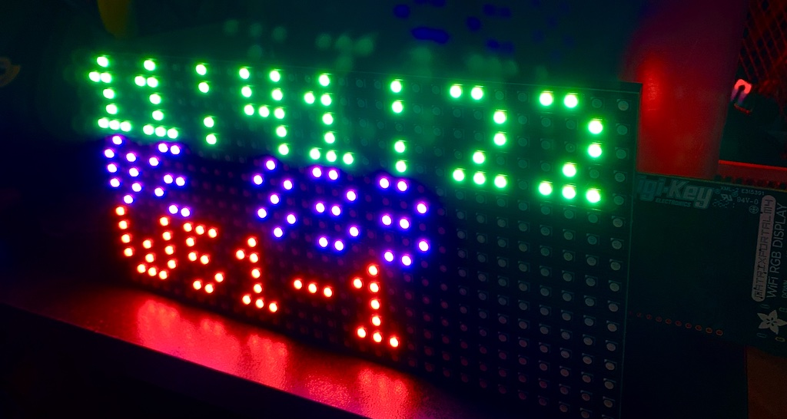
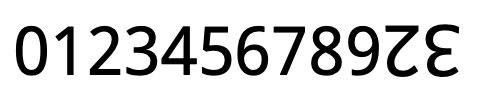
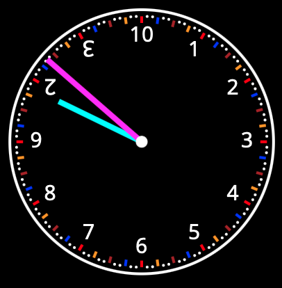
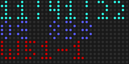

# MatrixPortal-M4-dozenal-clock
Configure the MatrixPortal-M4 to display a digital clock with decimal and dozenal (base-12) time

*Note: This README is not finished.*

A few months ago, I bought a
[MatrixPortal-M4](https://learn.adafruit.com/adafruit-matrixportal-m4) and LED matrix
display from Adafruit. My goal was to create some sort of digital dozenal (base-12) clock.

My starting point was [a project from Adafruit's web
site](https://learn.adafruit.com/network-connected-metro-rgb-matrix-clock) to build a
network-connected digital clock.

## Set-up

1. Follow [Adafruit's
instructions](https://learn.adafruit.com/network-connected-metro-rgb-matrix-clock/prep-the-matrixportal).
to build the Matrixportal-M4. (My code is designed to run on a 32 × 16 LED matrix display.)

2. Follow [Adafruit's
instructions](https://learn.adafruit.com/network-connected-metro-rgb-matrix-clock/install-circuitpython-2)
to install CircutPython on the MatrixPortal.

3. Follow [Adafruit's instructions](https://learn.adafruit.com/adafruit-matrixportal-m4/internet-connect) to create a `secrets.py`. It should look something like this:
    ~~~~python
    secrets = {
        "ssid": "WIFI_NETWORK_NAME",
        "password": "WIFI_NETWORK_PASSWORD",
        "timezone": "America/Chicago",
        "aio_username": "AIO_USERNAME",
        "aio_key": "AIO_KEY"
    }
    ~~~~
    We are using the [Adafruit IO](https://io.adafruit.com) service to get the time, so
    you'll need to have an account there.

4. Copy the files in the directory `copy_to_board` of this repo onto the MatrixPortal.

## Dozenal time

### Dozenal numbers

Dozenal is another name for the base-12 number system, in contract to the decimal
(base-10) system that is typically used. One convention is to use the characters `X` and
`E` to represent digits for 10 and 11, respectively. (Later, we will discuss a different
convention that I actually used on the clock.)

~~~~
Decimal:  0,  1,  2,  3,  4,  5,  6,  7,  8,  9, 10, 11, 12, 13, 14, 15, 16, 17, 18, 19,
Dozenal:  0,  1,  2,  3,  4,  5,  6,  7,  8,  9,  X,  E, 10, 11, 12, 13, 14, 15, 16, 17,

Decimal: 20, 21, 22, 23, 24, 25, 26, 27, 28, 29, 30, 31, 32, 33, 34, 35, 36, 37, 38, 39...
Dozenal: 18, 19, 1X, 1E, 20, 21, 22, 23, 24, 25, 26, 27, 28, 29, 2X, 2E, 30, 31, 32, 33...

Decimal: ... 142, 143, 144, 145, 146, 147, ...
Dozenal: ...  EX,  EE, 100, 101, 102, 103, ...
~~~~

### Rationale for dozenal

In many ways, the dozenal superior to decimal. The number 12 = 2 × 2 × 3 has more divisors
than 10 = 2 × 5. (In fact, 12 is an example of a
   [Superior highly composite
   number](https://en.wikipedia.org/wiki/Superior_highly_composite_number).)
As a consequence, dozenal expansions of fractions are more likely to terminate than
decimal expansions.

| Decimal fraction | Decimal expansion | Dozenal expansion |
|:-----------------| :-----------------| :-----------------|
| 1/2              | 0.5               | 0;6               |
| 1/3              | 0.3333333333...   | 0;4               |
| 1/4              | 0.25              | 0;3               |
| 1/5              | 0.2               | 0;249724972...    |
| 1/6              | 0.1666666666...   | 0;2               |
| 1/7              | 0.1428571429...   | 0;186X35186...    |
| 1/8              | 0.125             | 0;16              |
| 1/9              | 0.1111111111...   | 0;14              |
| 1/10             | 0.1               | 0;124972497...    |
| 1/11             | 0.0909090909...   | 0;111111111...    |
| 1/12             | 0.0833333333...   | 0;1               |

(In this table, we use `X` to represent 10, `E` to represent 11, and `;` as a radix
separator.)

### Pitman notation

Above, I used the digit `X` to represent 10 and `E` to represent 11. Another common
notation is the set of Pitman digits, which resemble the digits 2 and 3, rotated
180°. These are in Unicode at codepoints [U+218A (TURNED DIGIT
TWO)](https://codepoints.net/U+218A) and [U+218B (TURNED
DIGIT THREE)](https://codepoints.net/U+218B). Font support remains very spotty, although
Google's [Noto Sans Symbols](https://fonts.google.com/noto/specimen/Noto+Sans+Symbols)
font has them:

I use Pitman digits on my clock.

### Dozenal unit of time: Tim

The most common system of units in use today is the International System of Units, more
commonly known as the metric system. In the metric system, various units of the same
type differ by a factor of a power of 10, e.g. a kilogram is 103 grams and a
centimeter is 10-2 meters. Several systems have been created to mimic this in
base 12, and one such is the [Tim-Grafut-Maz (TGM)
system](http://www.dozenal.org/drupal/content/tgm-coherent-dozenal-metrology.html)
designed by Tom Pendlebury. In the TGM system, the basic unit of time is the Tim, which is
12-4 hours = 25/144 seconds.

When I first learned this, I wondered why the basic unit of time was based on an hour, and
not a day. But once you look at [a dozenal
clock](https://chrisphan.com/misc/dozenal_clock_simple/index.html), you see why:

If you focus on the hour (124 Tims) and the unciahour (1/12 hour = 123 Tims), you can use a traditional clock.

My clock displays the time in hours since midnight in dozenal on the second line.

The radix separator `;` blinks and was not when this image was taken. The time displayed,
using `X` and `E` instead of the Pitman digits, is `0E;883`. This means the current time
is 11 + 8/12 + 8/144 + 3/1728 hours past midnight.

*More to come...*
